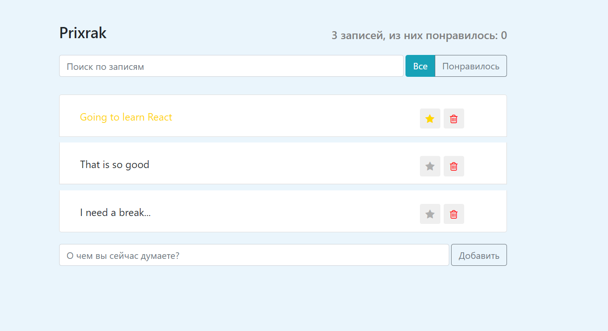
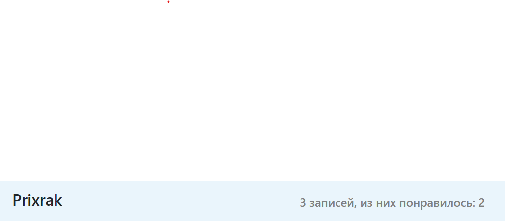
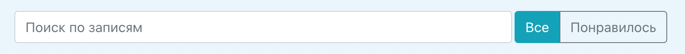
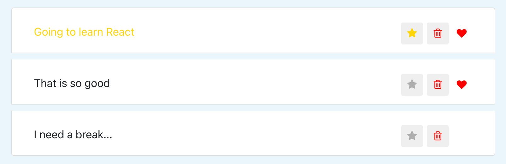
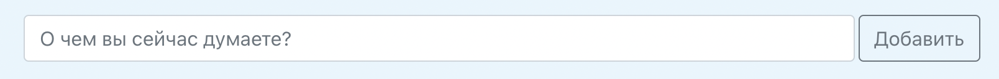

# React Application - "Mini Twitter"

This project was made according to the course of Ivan Petrichenko:
**[Полный курс по JavaScript + React - с нуля до результата](https://www.udemy.com/course/javascript_full/)**

#### Modules used:

- ESLint
- Webpack
- Babel
- Reactstrap

## The application looks like this

## Application components:

### AppHeader

Application header. Displays username, number of messages and number of liked messages. 

### SearchPanel (search form and StatusFilter)

Search form, allows you to search records by words. You can filter the posts by the ones you like.

### PostList and children PostListItem

List of records. You can add posts to your favorites by staring, delete a post, or like a post.

### PostAddForm

Form for adding posts.

This project was bootstrapped with [Create React App](https://github.com/facebook/create-react-app).

## Available Scripts

In the project directory, you can run:

### `npm start`

Runs the app in the development mode.\
Open [http://localhost:3000](http://localhost:3000) to view it in the browser.

The page will reload if you make edits.\
You will also see any lint errors in the console.

### `npm run build`

Builds the app for production to the `build` folder.\
It correctly bundles React in production mode and optimizes the build for the best performance.

The build is minified and the filenames include the hashes.\
Your app is ready to be deployed!

See the section about [deployment](https://facebook.github.io/create-react-app/docs/deployment) for more information.
